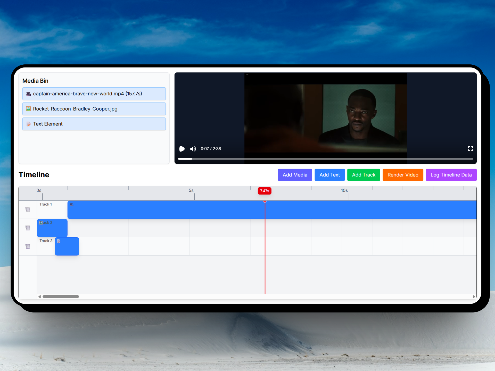

<samp>
  
<h1>Kimu</h1>
<p>Copilot for Video Editing.</p>
<br />

> [!NOTE]  
> The application is under active development. This is an early MVP. Please join the [Discord server](https://discord.gg/GSknuxubZK) if you're going to run it.

<br />

<p align="center">
  
</p>
<p align="center">An open-source alternative to Capcut, Canva, and RVE.</p>
</samp>

## ✨Features

- 🎬Non Linear Video Editing
- 🔀Multi-track Support
- 👀Live Preview
- 📤Export Video
- 📜Licensed under MIT

## 🐋Deployment

```
git clone https://github.com/robinroy03/videoeditor.git
cd videoeditor
docker compose up
```

## 🧑‍💻Development

```
pnpm i
pnpm run dev (frontend)
pnpm dlx tsx app/videorender/videorender.ts (backend)
uv run backend/main.py
flip `isProduction` to `false` in `/app/utils/api.ts`

You will also require a GEMINI_API_KEY if you want to use AI.
```

## 📃TODO

We have a lot of work! For starters, we plan to integrate all Remotion APIs. I'll add a proper roadmap soon. Join the [Discord Server](https://discord.com/invite/GSknuxubZK) for updates and support.

## ❤️Contribution

We would love your contributions! ❤️ Check the [contribution guide](CONTRIBUTING.md).

## 📜License

This project is licensed under the MIT License. The [Remotion license](https://github.com/remotion-dev/remotion/blob/main/LICENSE.md) also applies to the relevant parts of the project.
